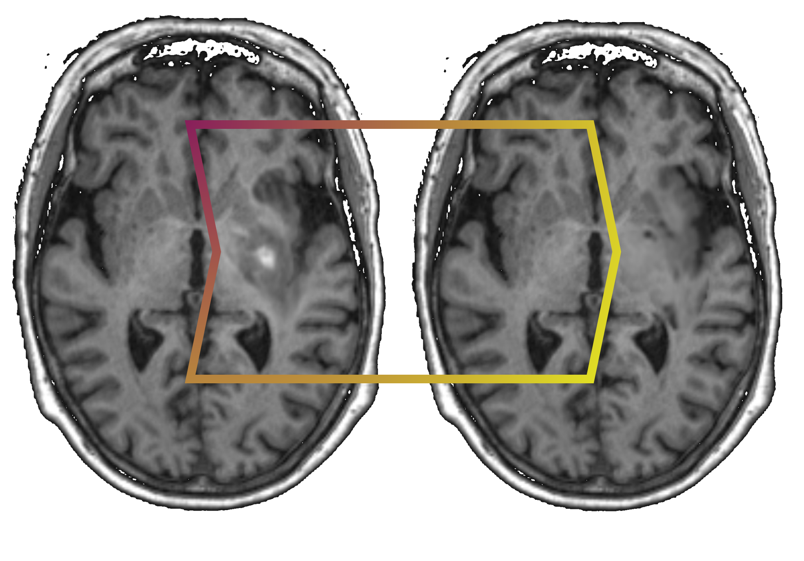

# *Le*sion *A*ware *P*rocessing *P*ipeline - Virtual Brain Transplant
modul for automated virtual brain transplant (vbt) following Solodkin et al. (2010) and 


## ABOUT

This code has been developed by the [brainsimulation section](www.brainsimulation.org) at the [Berlin Institute of Health at Charité](www.bihealth.org).

## DESCRIPTIONS

The modul VBT provides a stand alone call to perform virtual brain transplant as implemented in <sup>1</sup> building upon the method described in <sup>2</sup>.

<p align='center'>
    
</p>


### INPUT

The required mininmal input to run the virtual brain transplant is a single imput image and corresponding lesion mask within a BIDS folder structure:

```
/StudyFolder
    /Sub-${SubID}/
        /ses-${SesID}/
            /anat
                sub-${SubID}_T1w.nii.gz               # anatomical input image
                sub-${SubID}_T1w_lesion_mask.nii.gz   # corresponding lesion mask
```

### INSTRUCTIONS

To run the VBT substep use the docker call described below:

```bash
docker run \
    -v "PATH/TO/STUDYFOLDER":"/data" \          # Path to folder containing image to use for VBT
    -e Steps="vbt" \                                            # processing substep call
    -e SubID="${SubID}"                             # Subject ID following BIDS
    -e Image="anat/Sub-${SubID}_T1w.nii.gz" \             # image filename within STUDYFOLDER/SUBJECT/SESSION directory to transplant
    -e CostMask="anat/Sub-${SubID}_T1w_lesion_mask.nii.gz"    # corresponding lesion mask within STUDYFOLDER/SUBJECT/SESSION directory
    leapp:processing                                # container name
```

The example call performs virtual brain transplant for a given subject T1w image using the provided lesion mask. The filenames for input image and lesion mask are relative to the subjects session folder within the provided study folder containing all subjects data according to BIDS standard.

## REFERENCES

<sup>1</sup> Bey et al. (in prep), Lesion aware automated processing pipeline for multimodal neuroimaging stroke data and TheVirtualBrain (TVB).\
<sup>2</sup> [Solodkin et al. 2010, Virtual brain transplantation (VBT): a method for accurate image registration and parcellation in large cortical stroke](https://pubmed.ncbi.nlm.nih.gov/21175010/) \
