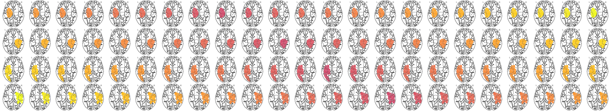

<p align='center'>
    
</p>

<p align="left">
    <!-- <a href="https://zenodo.org/badge/latestdoi/523258545"></a> -->
    <a href="https://joinup.ec.europa.eu/collection/eupl/eupl-text-eupl-12" alt="License-EUPL-1.2-or-later">
        </a>
</p>

# *Le*sion *A*ware *P*rocessing *P*ipeline: 
an automated, robust and validated processing pipeline for multimodal neuroimaging data in the presence of ischemic stroke lesions.


## ABOUT

This code has been developed by the [brainsimulation section](www.brainsimulation.org) at the [Berlin Institute of Health at Charité](www.bihealth.org).

Authors: \
Patrik Bey; patrik.bey@bih-charite.de 

## DESCRIPTIONS

This [BIDS](https://bids.neuroimaging.io) App provides an automated and validated processing framework for multimodal neuroimaging data in the presence of pathological lesion artefacts, specifically ischemic stroke lesions. It was created in an effort to provide an easy-to-use framework adjusted to lesion specific requirements and enable the user to process data in a reproducible, validated and automated fashion. The preseted pipeline is build around two pre-existing well established frameworks: the human connectome project (HCP) minimal processing pipeline <sup>2</sup> and the MRTrix3 processing software package <sup>3</sup>. 

The pipeline consists of four main modules followig the corresponding modalities \
[__structural__](Doc/STRUCTURAL.md), \
[__functional__](Doc/FUNCTIONAL.md) and \
[__diffusion__](Doc/DIFFUSION.md) imaging as well as a stand-alone call for performing \
[__virtual brain transplant__](Doc/VIRTUALBRAINTRANSPLANT.md) for a single input image. 

## REQUIREMENTS

The single requirement for the usage of either framework is the docker containerization software ([www.docker.com](https://www.docker.com)).

## INSTRUCTIONS


### 1. Building container

To build the desscribed __LeAPP__ processing container simply run the following line of code from inside the processing repository directory.


```bash
    docker build . -t leapp:processing -f Code/Dockerfile
```

### 2. Running container

This container follows a modular approach enabling general and specific run calls for individual processing steps.

General usage of the container follows the following pattern. More information about possible call variables can be accessed by running the container without any provided input parameters.

```bash
    docker run leapp:processing
```

The main input parameter are the data directory *STUDYFOLDER* to be mounted into the container at runtime, the corresponding processing step defined via *Steps* parameter and, in most cases the subject identifier *SubID*. All calls to the processing pipeline following the same modular structure as shown below. A full list of implemented options for container calls is shown in a table below.

```bash
    docker run \
        -v "PATH/TO/STUDYFOLDER":"/data" \  # mounting STUDYFOLDER and renaming in container filesystem as "/data"
        -e Steps="structural prefs lesion" \ # example call for LeAPP's PreFreeSurfer processing step
        -e SubID="P001" \ # Subject ID following BIDS standard naming conventions
        leapp:processsing # container name to run

```
This example call will perform all processing steps included in the adjusted PreFreeSurfer module as described in <sup>1</sup>.

Across all modules the *Steps* variable takes the value *lesion* if lesion corrections are to be performed. This requires the availability of a lesion mask in the /anat folder of the subject.


__Container call options__

```
-e SubID=<string>		Subject ID to use in pipeline 
							[required - integer]
-e Path=<path>			Path variable to study folder 
								[optional ; default : "/data" mounted volume to container via << -v >> option.]
-e SesID=-<string>		Session ID to use in pipeline
								[optional ; defaul : 01 ]
-e Steps=<string>		Processing steps to perform in run call.  [required]
							Space delimited list of steps and options. 
							Possible options: 
							<full>: Running all processing steps up to preprocessed DWI images.

							<vbt>: Only perform Virtual Brain Transplant

							<lesion>: boolean parameter whether to include lesion processing. 
										[not needed e.g. for processing of healthy controls]

							<nocleanup>: boolean whether to clean up temporary files

							<structural>: Perform structural processing steps [T1w & T2w image required]
								-possible substeps:
								<all>          : running all structural processing steps.
								<prefs>        : running only adjusted PreFreeSurfer steps.
								<fs>           : running only FreeSurfer steps. Requires
												"prefs" to be run before.
								<postfs>       : running only PostFreeSurfer steps. Requires 
													"prefs" and "fs" to be run before.
								<parcmap> : mapping of brain parcellation template to T1w extracted ribbon.
							
							<functional>: Perform fMRI processing [requires structural processing results]
								-possible substeps:
								<all>			: running all functional processing steps.
								<preproc>		: running HCP based volume processing
								<connectome>	: running connectome creation using average time series.
								<fmrifiles>     : file names for fmri time series to process [optional; default: all volumes found in <<./func>> directory.]
								<onsets>		: boolean if experimental design task onsets file to be used vs full time series [e.g. for the case of resting-state fMRI].

							<dwi>: Perform diffusion weighted imaging processing
								-possible substeps:
								<preproc>		: running all subject specific preprocessing steps.
								<normal>		: running population based intensity normalization.
								<segment>		: running 5 tissue type segmentation based on processed T1w image. Optional parameter:
								<response>		: running population based response function normalization.
								<connectome>	: running connectome creation with optional lesion embedding.
							
							<tvb>: Get minimally required TVB files for simulation and reformat. [currently not supported]

-e Atlas=<string>		Parcellation to use in SC creation [optional]
								[default : HCP-MMP1]

-e Streams=<integer>		Number of streamlines to compute in tractography [optional; default: 100Mio traces]								
							
-e MaskSpace=<string>	Basis space of provided lesion mask volume. [default: T1w]
							Possible <parameter>:
							<T1w>				: created lesion mask is based on T1w image
							<T2w>				: created lesion mask is based on T2w image
							<MNI>				: created lesion mask is based on MNI image
							<FLAIR>				: created lesion mask is based on FLAIR image

-e Image=<filepath>		VBT Input image filename relative to '${Path}'

-e Mask=<filepath>			VBT Input mask filename relative to '${Path}'

-e SmoothingFactor=<int>	Smoothing factor for use in Gaussian Kernel during virtual brain transplant

-e LesionEmbed=<string>   : type of lesion embedding in 5tt segmentation; possible versions <<mrtrix, experimental>> (see documentation for details).
```

### Acknowledgements


Please acknowledge this work by citing <sup>1</sup>.

The presented framework includes a range of software tools that might have citation requirements:

----
FREESURFER (https://surfer.nmr.mgh.harvard.edu) \
FSL (http://fsl.fmrib.ox.ac.uk/fsl/fslwiki/) \
MRTrix3 (http://www.mrtrix.org/)  <sup>3</sup> \
UBUNTU (http://www.ubuntu.com) \
PYTHON3 (http://www.python.org) \
ANTS (https://github.com/ANTsX/ANTs) \
MATLAB Compiler (https://www.mathworks.com) \
MINICONDA (https://www.conda.io) \
HCP PROCESSING PIPELINE (https://www.humanconnectome.org) <sup>2</sup> 


## REFERENCES

<sup>1</sup> Bey, P., Dhindsa, K., Kashyap, A., Schirner, M., Feldheim, J., Bönstrup, M., Schulz, R., Cheng, B., Thomalla, G., Gerloff, C., & Ritter, P. (2024). A lesion-aware automated processing framework for clinical stroke magnetic resonance imaging. Human Brain Mapping, 45(9), e26701. https://doi.org/10.1002/hbm.26701 \
<sup>2</sup> [Glasser et al. 2013, The minimal preprocessing pipelines for the Human Connectome Project](http://dx.doi.org/10.1016/j.neuroimage.2013.04.127) \
<sup>3</sup> [Tournier et al. 2019, MRtrix3: A fast, flexible and open software framework for medical image processing and visualisation](https://doi.org/10.1016/j.neuroimage.2019.116137)

