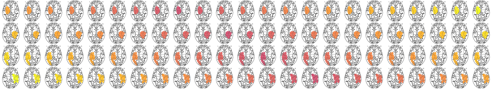

<p align='center'>
    
</p>

<p align="left">
    <!-- <a href="https://zenodo.org/badge/latestdoi/523258545"></a> -->
    <a href="https://joinup.ec.europa.eu/collection/eupl/eupl-text-eupl-12" alt="License-EUPL-1.2-or-later">
        </a>
</p>

# *Le*sion *A*ware *P*rocessing *P*ipeline: 
an automated, robust and validated processing pipeline for multimodal neuroimaging data in the presence of ischemic stroke lesions.


## ABOUT

This code has been created by the [brainsimulation group](http://brainsimulation.org/) as part of the development of processing validation of the *lesion aware automated processing pipeline (LeAPP)*<sup>1</sup>.
It has further been used in the validation study *Cost function masking (CFM) inflates group level difference in processing of MRI data.* Bey, Dhindsa and Ritter (2022)<sup>2</sup>.

## DESCRIPTIONS
This container automatically computes a range of agreement measures and analysis to validate agreement between processing results following varying processing approaches or methodologies. Following [Taha & Hanbury. (2015)](https://bmcmedimaging.biomedcentral.com/articles/10.1186/s12880-015-0068-x) we integrated *dice score*, *jaccard score* and *volume difference* as agreement measures to ensure a complimentary analysis of various local and global properties.
We further integrated machine learning based classification of binary groups following ([Baghwat et al. (2021)](https://pubmed.ncbi.nlm.nih.gov/33481004/)) to approximate processing impact on classical group level analysis where applicable.
This container was used

## REQUIREMENTS

The single requirement for the usage of this container is the docker containerization software ([www.docker.com](https://www.docker.com)).


## INSTRUCTIONS

### 1. Building container

To build the provided  __LeAPP - validation__  docker container simply run the following line of code.


```bash
    docker build . -t leapp:validation -f Code/Dockerfile
```

### 2. Running container

The running of the container follos a simple principle of modular calls to enable fast independent application.


```bash
    docker run \
        --v "/Path/to/data/":"/data" \
        --e Step="agreement" \
        --e Mode="atlas" \
        --e Atlas="HCPMMP1" \
        --e Level="local" \
        --e Labels="HCP,LeAPP" \
        leapp:validation
```

This example call will perform the computation of local agreement metrics based on the LeAPP parcellation atlas files. The comparison will be performed for the two groups defined via the *Labels* variable. The assumed folder structure will follow the schemata shown below.

```
/Path/to/data
    |_LeAPP
        |_sub-1_HCPMMP1.nii.gz
        |_sub-2_HCPMMP1.nii.gz
    |_HCP
        |_sub-1_HCPMMP1.nii.gz
        |_sub-2_HCPMMP1.nii.gz

```
The files contained in either group have to be identical in naming and count otherwise a completion check error will be thrown.


__Container call options__


```

***************************************************************
***                    LeAPP VALIDATION                     ***

*** ------------ USAGE ------------ ***

docker run \
    -e Path=<string>       [optional] Path to input files.
                            default: /data bound volume to container

    -e Mode=<string>        [optional] Mode of input image to validate 
                           Possible options values:
                            <ribbon>:     Cortical ribbon validation
                            <WM>:         White matter mask validation
                            <string_WM>:  using "string_WM" volumes. (e.g. "FSL_WM")
                            <atlas>:      Atlas ROI based validation
                                required parameters:
                                <<Atlas>>
                            <connectome>:  Connectome network validation
                                required parameters:
                                <<Level>>
                                <<Connectome>>

    -e Atlas=<string>       [optional] Parcellation used for ROI based validation. Required for atlas
                                       volume validation mode
    
    -e Level=<string>       [optional] Level of connectome based network metrics. Required for 
                                       connectome validation.
                                       Possible options values:
                                       <global>:   global network metrics
                                       <local>:    local network metrics

    -e Labels=<string>      [required] Comma delimited list of group labels to perform comparison for

    -e Step=<string>        [required] Validation step to perform.
                            Possible options values:
                            <agreement>:  Running computation of agreement measures
                                required parameters:
                                    <<Mode>> 
                                    <<Labels>>

                            <metrics>:  Running metric computations
                                required parameters:
                                    Input image to segment.
                                optional parameter:
                                    OutDir output directory for segmentation results.

                            <stats>: Running statistical testing for groups
                                required parameters:
                                    Input matrices
                                optional parameters:
                                    
                            <learning>:   Running machine learning based classification
                                required parameters:
                                    <<Files>> [ list of group features]
                                optional parameters:
                                    <<cvsplit>> [Cross Validation split

    -e Files=<string>      [optional] list of comma/semicolo/space seperated input files
                            a single file for each group [subject x features]
    
    -e Connectome=<string>  [optional] Connectome name to use for validation
    
    -e CVSplit=<float>      [optional] value between 0 and 1 defining training / test split
                            If not provided default used is 0.1
    
    -e PrefixOut=<string>   [optional] Prefix used for classification output files
                            If not provided default used is "OutPut_"

    -e OutDir=<string>      [optional] Path to output directory.

*** ------------ INPUT ------------ ***


The expected file directory structure:
<<Path>>
    |___GroupLabel[1]
        |___sub-0001_filename.nii.gz
        ...
    |___GroupLabel[2]
        |___sub-0001_filename.nii.gz


```

### Acknowledgements


Please acknowledge this work by citing <sup>1</sup>.


Maintenance
----------------

This code was originally developed for the above mentioned project. Maintenance will be performed non regularly.
Maintainer: patrik.bey@bih-charite.de


## REFERENCES

<sup>1</sup> Bey et al. (in prep), Lesion aware automated processing pipeline for multimodal neuroimaging stroke data and TheVirtualBrain (TVB).

<sup>2</sup> Bey, P., Dhindsa, K., & Ritter, P. (2022). Cost function masking (CFM) inflates group level difference in processing of MRI data. In *FENS Forum 2022*. [DOI](https://figshare.com/s/52d844dde062f5b75c9e)
